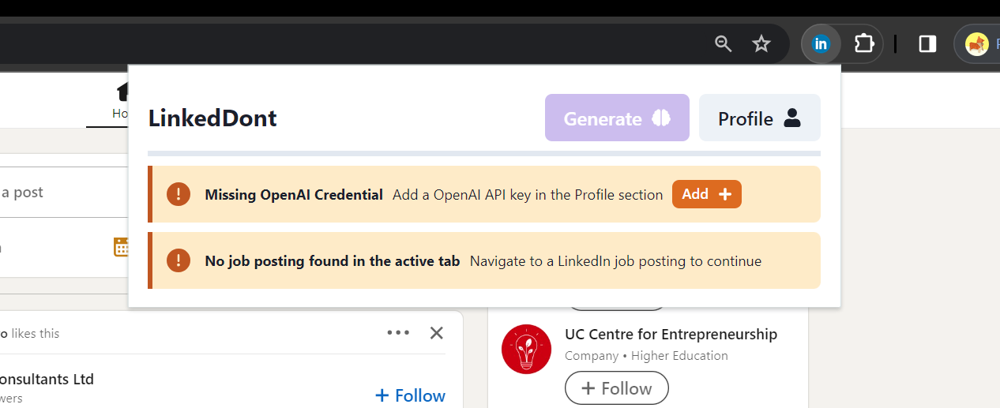
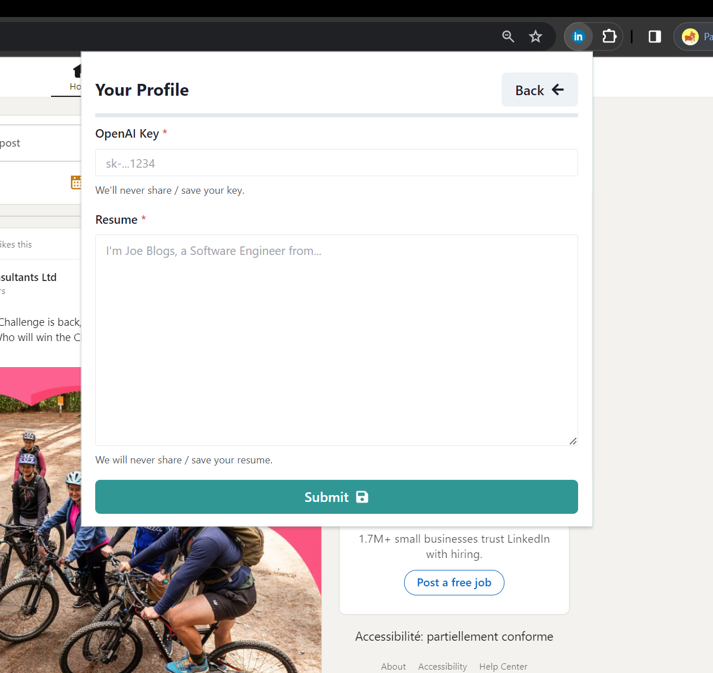
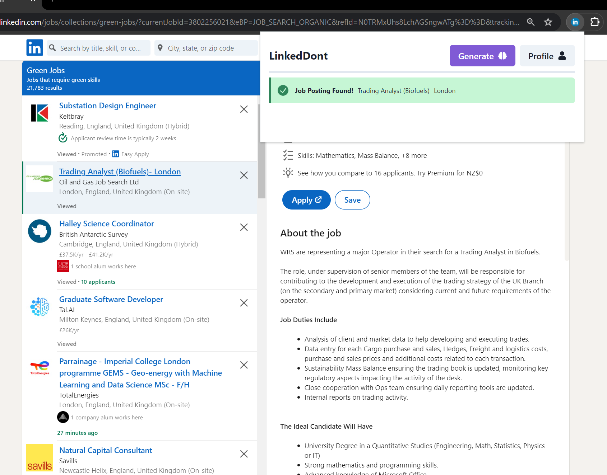
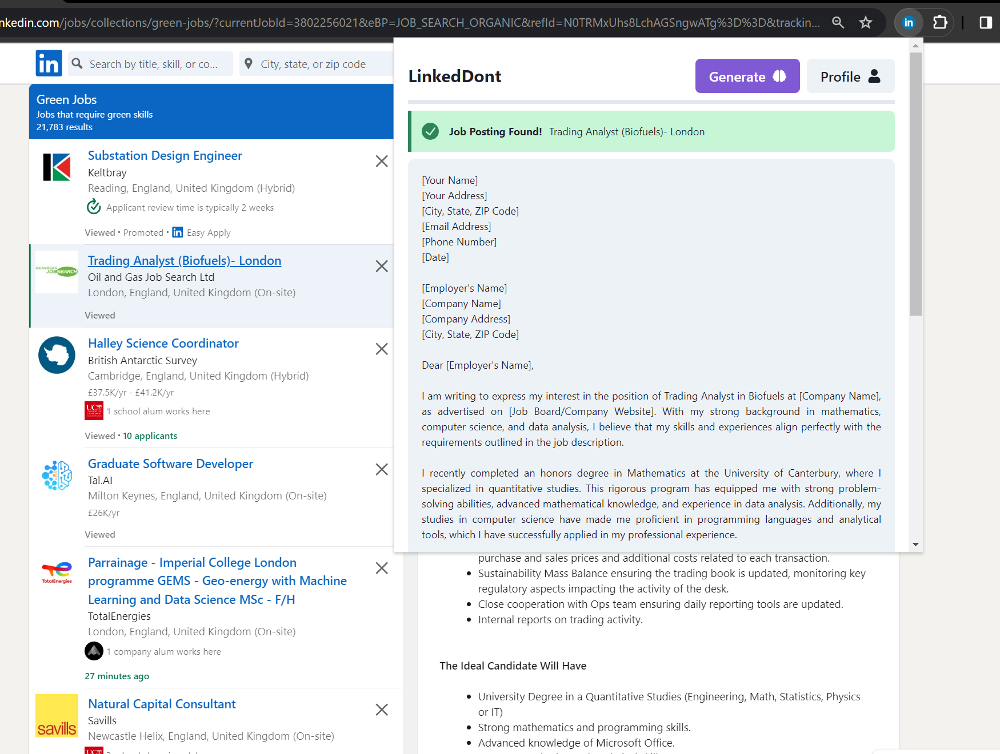

# LinkedDont

**This project exists as an exercise for learning how to embed ChatGPT inside of a Chrome Extension, the name LinkedDont is short for 'LinkedDont use this for real.'**

1. _To begin, you need to attach your API Key and navigate your active browser to a LinkedIn job posting._

2. _You can add your OpenAI key and Resume by navigating to the profile section_

3. _After these conditions are met, you will be bale to click 'Generate'_

4. _After a request to OpenAI, you will see the Cover Letter appear in the extension popup!_

